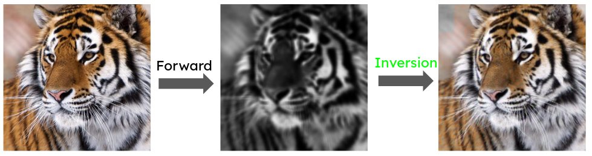

# Image Inversion

The intention of this project is to recover the original image from blurring and decoloration. We investigate 2 blurring models (average and gaussian blur), a particular grayscale conversion, and a simple nonlinear transformation (square) present in the forward model. The inversion problem is initially performed on the individual components of the forward model. That is, we try to (1) recover the grayscale image from a blurred grayscale image and (2) recover an RGB image from a grayscale one. Because the grayscale inversion is ill-posed, we also investigate the effects of a prior on the reconstruction. Techniques include FFT-based Expectation Maximization (EM), pseudo-inverses, and solving least squares. We perform inversion of the entire RGB-to-blurred grayscale forward model using a pseudo-inverse approach and a linear Gaussian approach. We finally inject a simple nonlinearity into the forward model and solve the inversion using gradient descent in PyTorch. 
